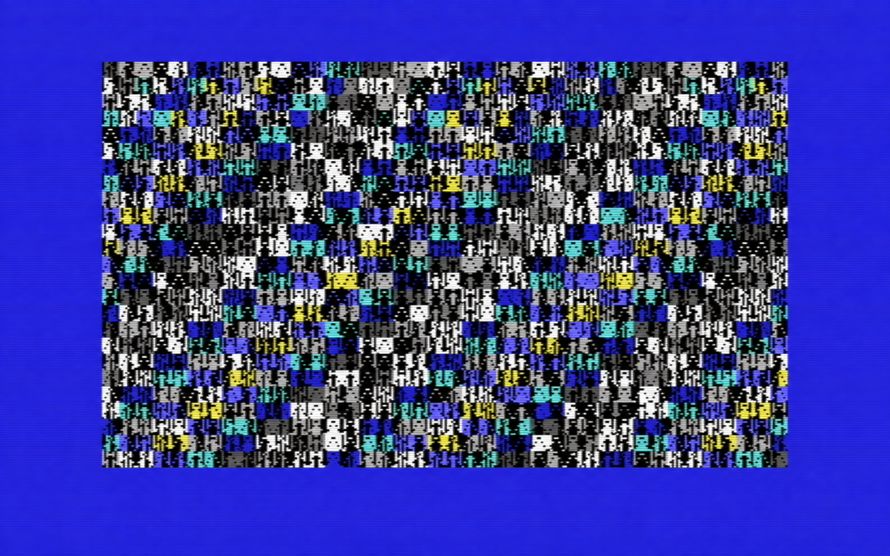
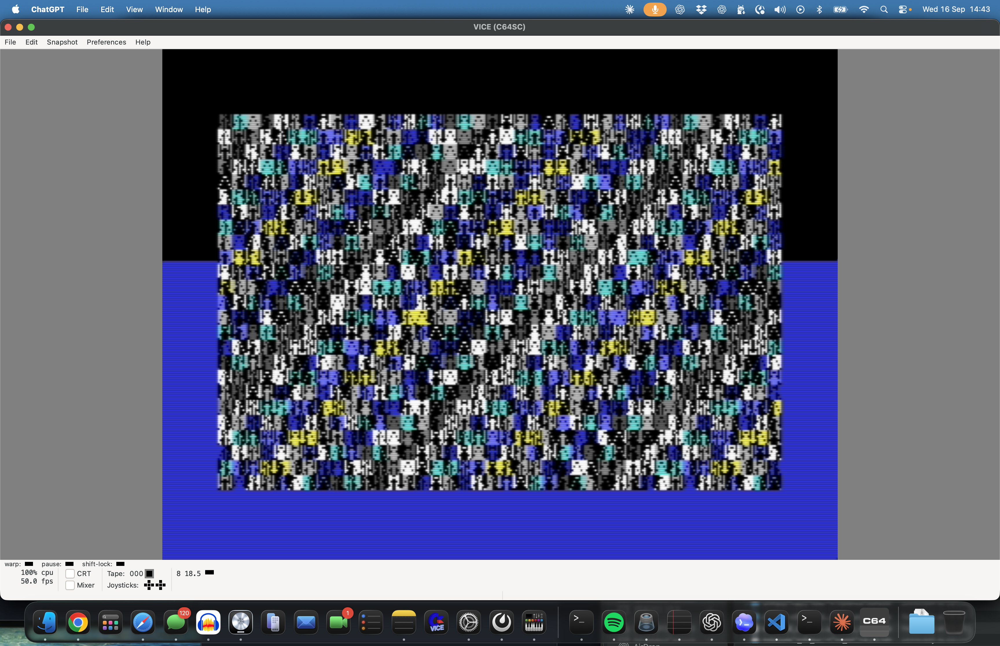

# Atlantis Bitmap Demo

Copyright © 2026 Ulf Bertilsson. Licensed under the
[GNU General Public License v3.0 or later](LICENSE).

Pure bitmap-only C64 demo pipeline. The active flow is FX00–FX24, all in VIC bank 2 hires bitmap mode, with the Atlantis Gabber soundtrack.





## Build

```bash
./build.sh
./run.sh
```

`src/atlantis_bitmap_demo.s` is the only source file.

## Verify and clean

```bash
make audit
make release
make clean
```

`make audit` assembles with strict segment checks and verifies deterministic
output. `make release` creates the v1.0.0 distribution archive in `dist/`.
`make clean` removes only generated files in `build/`.

## Contract

- CPU/PLA `$01=$36`
- VIC bank 2
- screen `$8400`
- bitmap `$A000`
- `D018=$18`, `D011=$3B`, `D016=$08`
- placement: `row*320 + col*8 + byteRow`

## Effect flow

The demo is a timed sequence of 25 effects. FX00–FX07 establish warp, gate,
starfield, plasma, lightning, fire/ice, and temple motifs. FX08–FX15 develop
the Atlantis theme with sonar rings, mirror runes, scanner, core, vortex,
circuit, and bloom patterns. FX16–FX24 form the finale: trident, abyss grid,
pressure runes, lattice, kraken pulse, tide wall, sunken finale, and seal.

## Rendering logic

`LoadPart` resets the SID gates, bitmap memory, colour matrix, timer, and
music position for the next effect. The sequencer then dispatches the matching
FX update routine through a vector table.

Every update increments `LocalTick` and renders one of four checkerboard
phases of the 40×25 cell grid. `DrawBitmapCellField` derives each 8×8 cell
address as `row*320 + col*8`, seeds a base bitmap pattern from position and
time, invokes the selected effect pattern, then writes the eight bitmap bytes
and its colour matrix entry. Over four frames, every visible cell is refreshed.

The main loop restores the VIC/PLA bitmap contract before each frame, while a
raster IRQ supplies `FrameReady`. Music ticks at 50 Hz; Space skips to the
next effect and aligns the music phrase.

## Code map

- `FX00_Update`–`FX24_Update`: effect selection and animation entry points.
- `LoadPart` and `UpdateSequencer`: timed part transitions and vector dispatch.
- `DrawBitmapCellField`: four-phase cell renderer and colour update.
- `Pattern_*`: effect-specific bitmap transforms.
- `MusicTick`: three-voice SID tracker update.

## Seal finale

FX24 is the seal finale: center lock/cross plus ring/rune fold, bitmap-only,
with no text/charset path and no music change.
